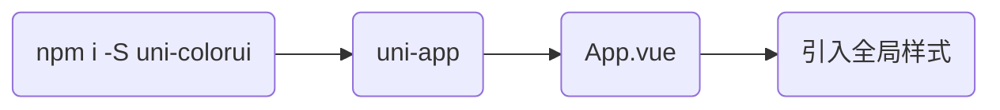

# uni-colorui

### [鲜亮的高饱和色彩，专注视觉的小程序组件库2.x版本](https://www.color-ui.com/) 

#### 1.[完整安装包下载](https://www.color-ui.com/)

#### 2.npm使用（[uni-app](https://uniapp.dcloud.io/collocation/App)）



```
npm install -S uni-colorui@2.1.6
```
* _*注意：uni-colorui@2.1.6版本引用方式（在线字体）*_

`App.vue`
```
<style>
	/*每个页面公共css */
	@import "uni-colorui/theme/main.css";
	@import "uni-colorui/theme/icon.css";
	@import "uni-colorui/theme/animation.css";
</style>
```
`main.js`
```
import cuCustom from 'uni-colorui/theme/components/cu-custom.vue'
// 自定义导航栏
Vue.component('cu-custom', cuCustom)
```
* _*注意：uni-colorui大于2.1.6版本引用方式（离线字体）*_
```
npm install -S uni-colorui@2.1.6
```
`main.js`
```
import "uni-colorui/lib/main.css";
import "uni-colorui/lib/icon.css";
import "uni-colorui/lib/animation.css";

import cuCustom from 'uni-colorui/lib/components/cu-custom.vue'
// 自定义导航栏
Vue.component('cu-custom', cuCustom)
```

#### 3.[仓库地址](https://github.com/weilanwl/ColorUI)

#### 4.[开源协议](https://raw.githubusercontent.com/weilanwl/ColorUI/master/LICENSE)

#### 5.[注意事项](https://raw.githubusercontent.com/weilanwl/ColorUI/master/Colorui-UniApp/colorui/main.css)

```
使用ColorUi开发扩展与插件时，请注明基于ColorUi开发 
```
更新说明：
* 2021-02-12 更新2.1.6.1版本，在线字体改为离线字体
